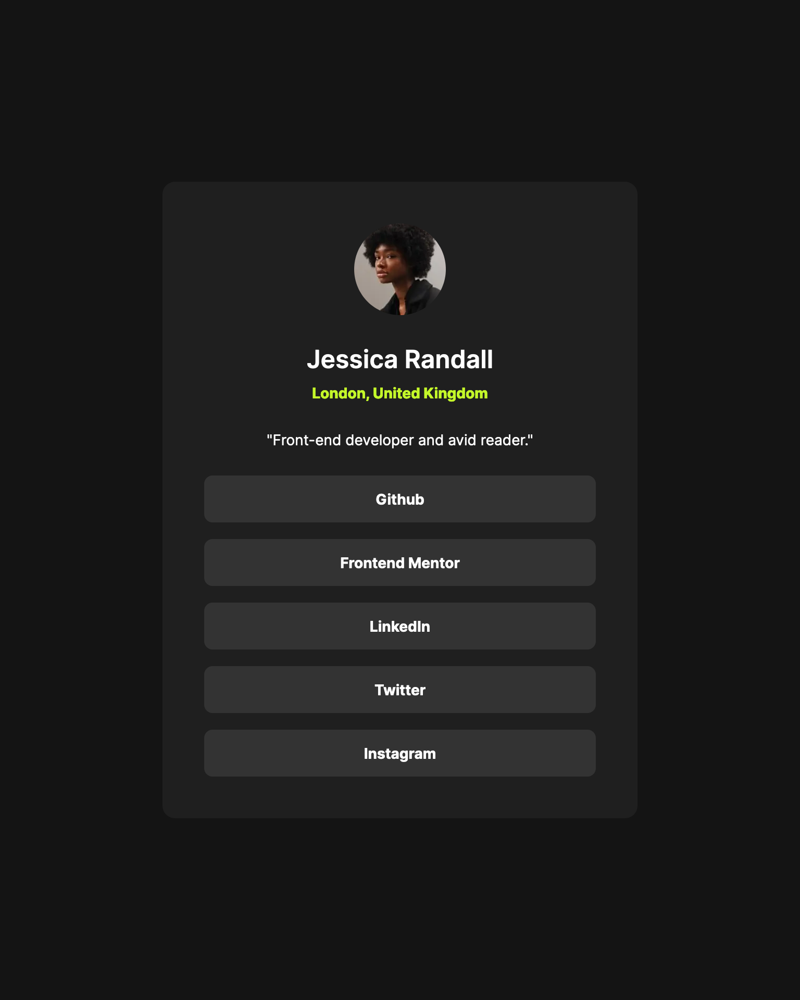
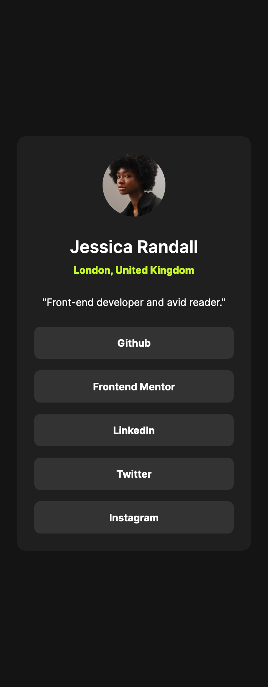

# Frontend Mentor - Social links profile solution

This is a solution to the [Social links profile challenge on Frontend Mentor](https://www.frontendmentor.io/challenges/social-links-profile-UG32l9m6dQ). Frontend Mentor challenges help you improve your coding skills by building realistic projects.

## Table of contents

- [Overview](#overview)
  - [The challenge](#the-challenge)
  - [Screenshot](#screenshot)
  - [Links](#links)
- [Getting Started](#getting-started)
  - [Prerequisites](#prerequisites)
  - [Installation](#installation)
- [My process](#my-process)
  - [Built with](#built-with)
  - [What I learned](#what-i-learned)
  - [Continued development](#continued-development)
  - [Useful resources](#useful-resources)
- [Author](#author)

## Overview

### The challenge

Users should be able to:

- View the optimal layout depending on their device's screen size
- See hover states for interactive elements

### Screenshot

<div style='display: flex; gap: 10px;'>



</div>

### Links

- Solution URL: [https://www.frontendmentor.io/solutions/social-links-profile-with-nextjs-tailwind-css-6ASgFwfwW1]
- Live Site URL: [https://social-links-profile-amber-chi.vercel.app/]

## Getting Started

To get a local copy up and running follow these simple steps:

### Prerequisites

Make sure you have the following software installed on your machine:

- [Node.js](https://nodejs.org/) (Node.js 18.17 or later)
- [pnpm](https://pnpm.io/)

### Installation

1. Clone the repository:

   ```sh
   git clone https://github.com/jaceleedev/social-links-profile.git
   ```

2. Navigate to the project directory:

   ```sh
   cd social-links-profile
   ```

3. Install dependencies using pnpm:

   ```sh
   pnpm install
   ```

4. Start the development server:

   ```sh
   pnpm dev
   ```

5. Open your browser and visit http://localhost:3000 to view the project.

## My process

### Built with

- Next.js (v14.2.5)
- TypeScript (v5)
- Tailwind CSS (v3.4.1)
- Semantic HTML5 markup
- CSS Flexbox
- SEO & web accessibility

### What I learned

Throughout this project, I gained valuable insights and improved my skills in several areas:

1. Responsive Design: I deepened my understanding of responsive layouts by using Flexbox along with techniques like max-width and flex: 1 1 0, moving away from fixed widths for more flexible designs.

2. Troubleshooting Layout Issues: I encountered and overcame challenges related to the max-width property not working as expected due to the relationship between nested elements. This experience enhanced my problem-solving skills in CSS layouts.

3. Development Efficiency: Building on my experience from the blog-preview-card challenge, I noticed an improvement in my development speed and efficiency in implementing similar concepts.

4. Performance and Accessibility Considerations: This project highlighted the importance of considering performance optimization and accessibility features from the early stages of development.

These learnings have not only improved my technical skills but also given me a clearer direction for future growth and areas to focus on in upcoming projects.

### Continued development

In future projects, I want to continue focusing on and improving in these areas:

1. Advanced CSS Techniques: I aim to explore the potential of combining CSS Grid with Flexbox for creating more complex and flexible layouts. This will allow me to tackle more challenging design requirements and create more sophisticated user interfaces.

2. Responsive Design Patterns: While I've improved my skills with Flexbox, I want to explore more advanced responsive design patterns and techniques to create even more adaptable layouts that are optimized for various screen sizes.

By focusing on these areas, I hope to continually improve my front-end development skills and create more efficient and sophisticated web applications.

### Useful resources

- [Next.js Documentation](https://nextjs.org/docs) - Comprehensive guide to Next.js features and API.
- [Tailwind CSS Documentation](https://tailwindcss.com/docs/installation) - Detailed documentation for Tailwind CSS.
- [A Complete Guide to Flexbox](https://css-tricks.com/snippets/css/a-guide-to-flexbox/) - Comprehensive guide to CSS Flexbox.

## Author

- GitHub - [@jaceleedev](https://github.com/jaceleedev)
- Frontend Mentor - [@jaceleedev](https://www.frontendmentor.io/profile/jaceleedev)
