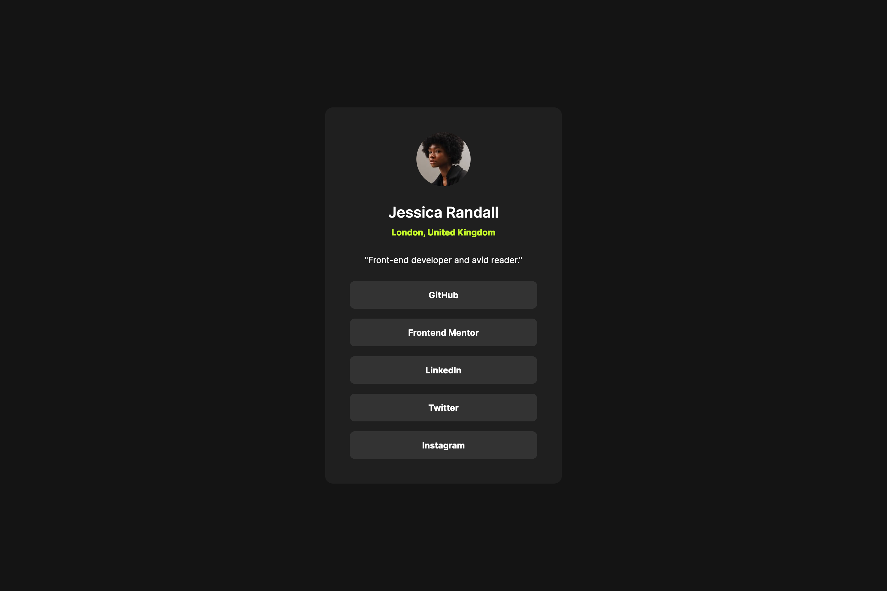
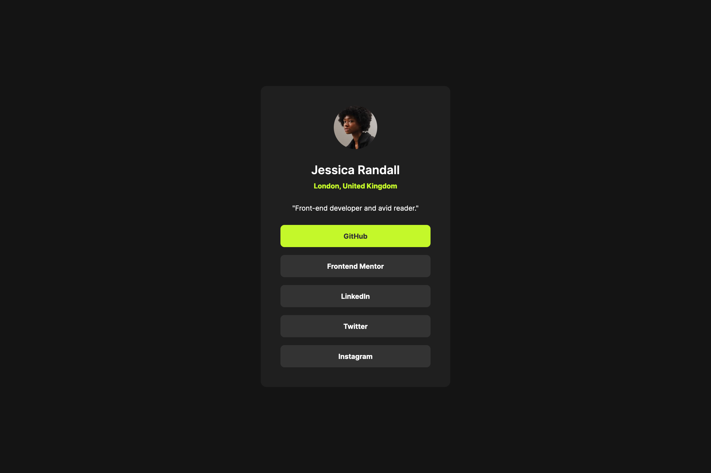
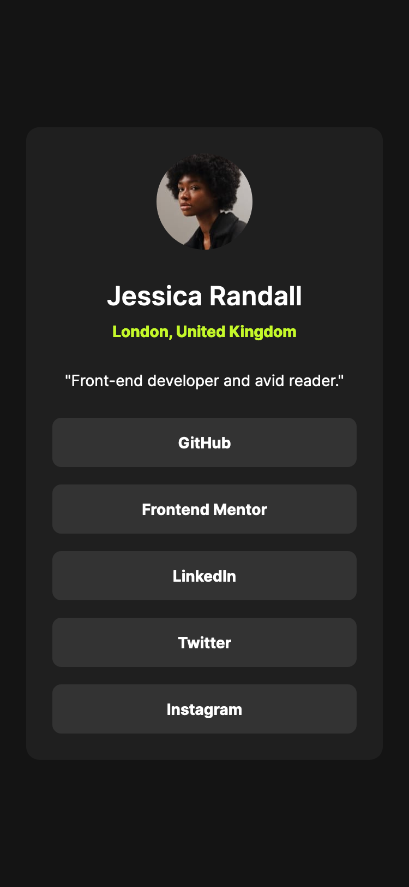

# Frontend Mentor - Social links profile solution

This is a solution to the [Social links profile challenge on Frontend Mentor](https://www.frontendmentor.io/challenges/social-links-profile-UG32l9m6dQ). Frontend Mentor challenges help you improve your coding skills by building realistic projects.

## Table of contents

- [Overview](#overview)
  - [The challenge](#the-challenge)
  - [Screenshot](#screenshot)
  - [Links](#links)
- [My process](#my-process)
  - [Built with](#built-with)
  - [What I learned](#what-i-learned)
- [Author](#author)

## Overview

### The challenge

Users should be able to:

- See hover and focus states for all interactive elements on the page

### Screenshot

### Links

- Solution URL: [solution URL](https://github.com/jaceleedev/social-links-profile)
- Live Site URL: [live site URL](https://jaceleedev.github.io/social-links-profile)

## My process

### Built with

- HTML5
- CSS3
- Figma Design

### What I learned

이전에 제작했던 blog-preview-card처럼 레이아웃을 잡는 것이 크게 어렵지 않았다. 그래서 flexbox만을 사용해 레이아웃을 구성했는데, 자식 요소들에게도 display: flex;를 꼼꼼하게 해주어야 했다. 그래서 내가 레이아웃 구성을 잘못하고 있는 것 같은 느낌이 들었다. 하지만 완성하고 보니, 챌린지의 요구사항대로 잘 나와서 오히려 방법에 대한 자신감을 얻게 되었다.

이번 레이아웃은 모바일 디자인을 우선적으로 제작하고, 데스크탑 버전을 그 이후에 맞춰보았다. 아쉽게도 레이아웃의 차이가 거의 없었기 때문에, 앞으로의 챌린지에서 더 연습해보려고 한다.

## Author

- Github - [Jaceleedev](https://github.com/jaceleedev)
- Frontend Mentor - [jaceleedev](https://www.frontendmentor.io/profile/jaceleedev)
